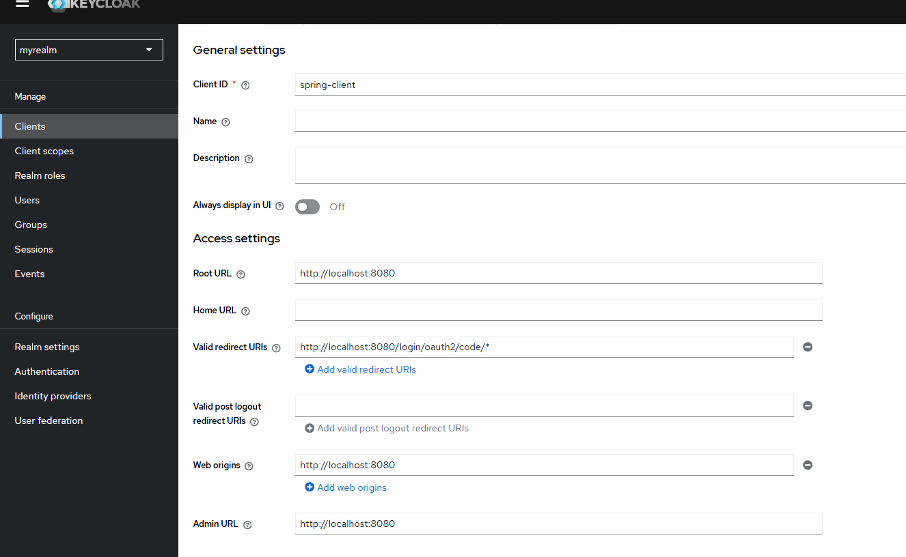
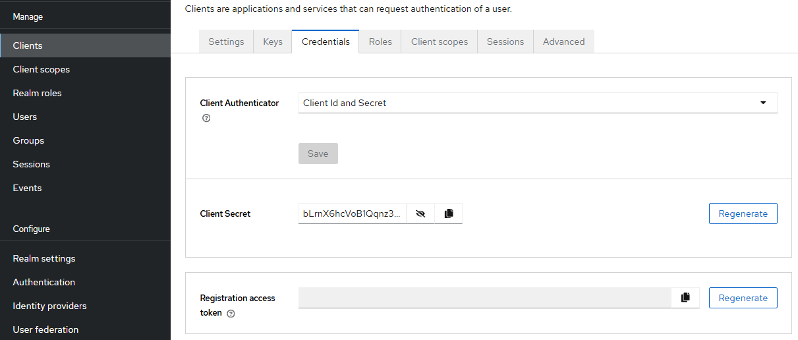
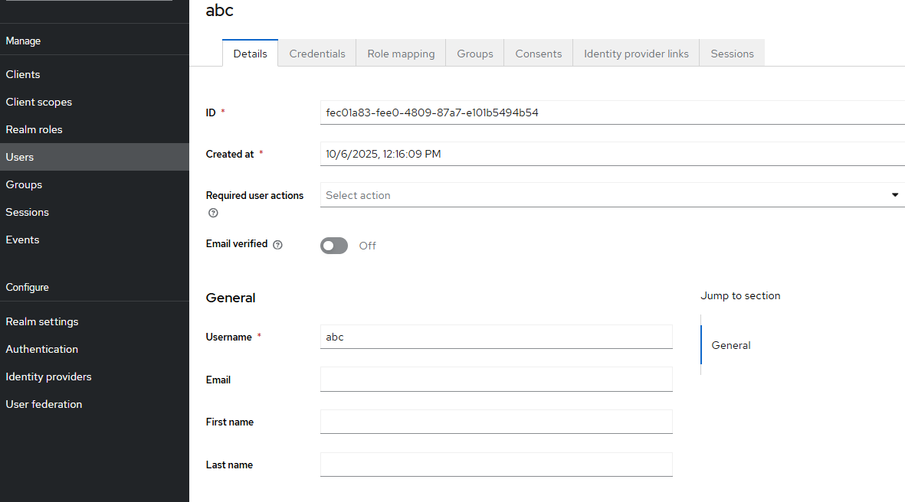
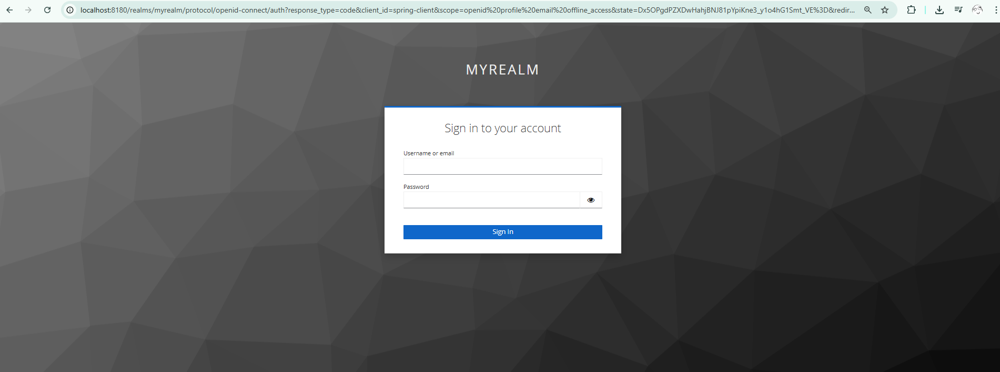
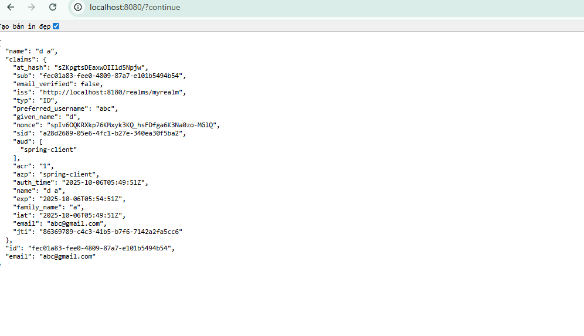
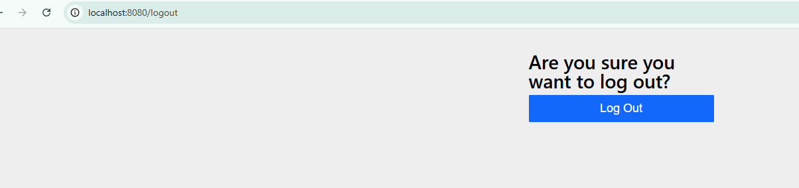

Chạy keyclock tren docker map ra cổng 8180 trên host
`docker run -d \
  --name keycloak \
  -p 8180:8080 \
  -e KEYCLOAK_ADMIN=admin \
  -e KEYCLOAK_ADMIN_PASSWORD=admin \
  quay.io/keycloak/keycloak:25.0.0 \
  start-dev`
vào Keyclock admin UI với tài khoản admin | admin,

Tạo realm với realm name : myrealm
tạo client trong realm :  
    name : spring-client
    root URL : http://localhost:8080
    Valid redirect URIs : http://localhost:8080/login/oauth2/code/*
    Client authentication -> ON
    Sau khi tạo client xong sẽ có được Client Secret -> copy secret vào application.yml

Tạo User trong realm :
    giả sử tạo user với tài khoản abc | 123

chạy spring boot : 
    vào terminal ./mvwn spring-boot:run (window)

vào localhost:8080 sẽ redirect sang trang login của keycloak

đăng nhập với tài khoản abc | 123, spring sẽ trả về thông tin user

truy cập localhost:8080/logout để clear session ở spring

sau khi logout và vào lại localhost:8080 thì cũng sẽ trả về thông tin của user
(đây là cách hoạt động của SSO, logout ở spring nhưng keycloak vẫn chưa logout nên vẫn auth dc user)

Để logout hoàn toàn vào localhost:8080/fullLogout, khi đó spring sẽ redirect về trang login ban đầu của keycloak
(đã logout cả ở spring và keycloak)

