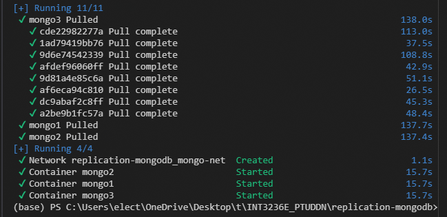
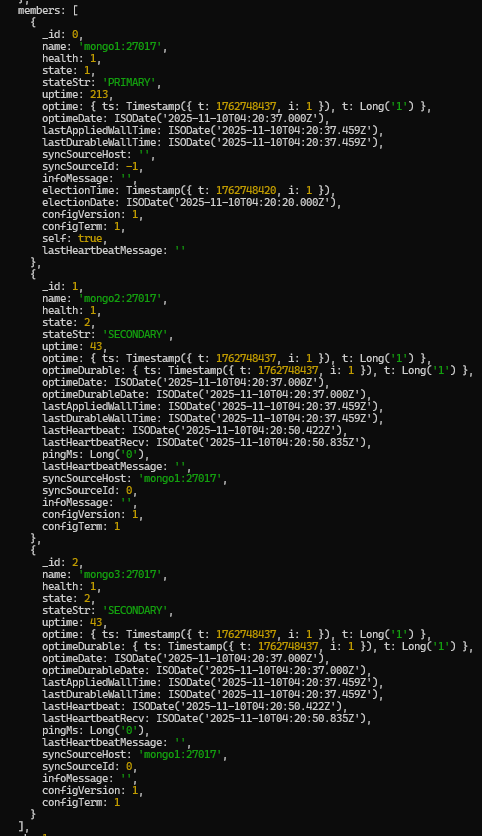
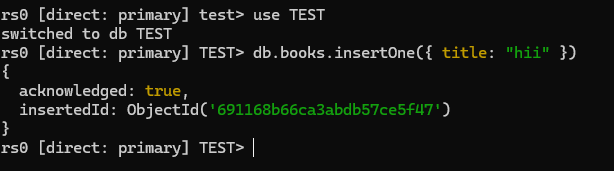
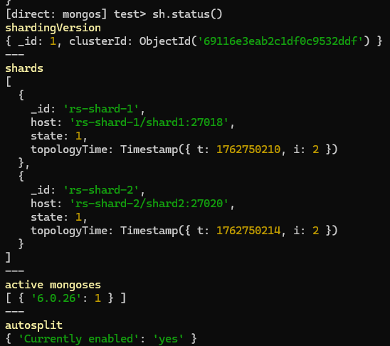
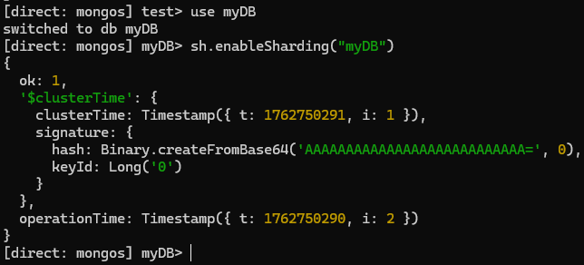
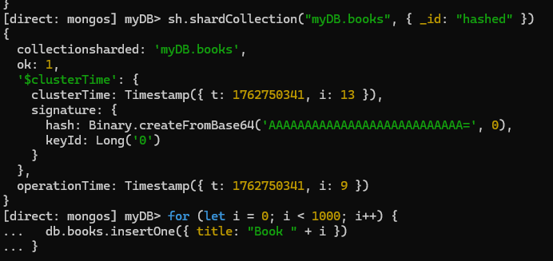
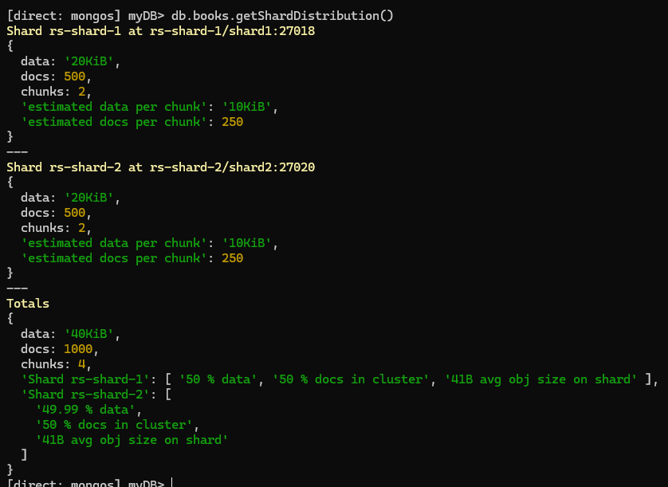

`docker-compose up -d`
chạy mongodb

`docker exec -it mongo1 mongosh`

vao console cua mongo1

`rs.initiate({
  _id: "rs0",
  members: [
    { _id: 0, host: "mongo1:27017" },
    { _id: 1, host: "mongo2:27017" },
    { _id: 2, host: "mongo3:27017" }
  ]
})`
sau khi tạo replica set thì mongo1 thành primary

insert vao primary

trong mongo2 (secondary) bật chế độ đọc sẽ thấy data đã đc đồng bộ

---------------------------------------------------------

chay cac replica 
`docker compose -f docker-compose-shard.yml up -d`

khởi tạo config server
`docker exec -it configsvr mongosh --port 27019`

`rs.initiate({
  _id: "rs-config",
  configsvr: true,
  members: [{ _id: 0, host: "configsvr:27019" }]
})`

khởi tạo các replica :

Shard 1:
    `docker exec -it shard1 mongosh --port 27018`
    `rs.initiate({
    _id: "rs-shard-1",
    members: [{ _id: 0, host: "shard1:27018" }]
    })`

Shard 2:
    docker exec -it shard2 mongosh --port 27020
    rs.initiate({
    _id: "rs-shard-2",
    members: [{ _id: 0, host: "shard2:27020" }]
    })

Trong router kết nối 2 shard :
docker exec -it mongos mongosh --port 27017
sh.addShard("rs-shard-1/shard1:27018")
sh.addShard("rs-shard-2/shard2:27020")

bật sharding cho DB: 

ví dụ chọn shard key theo _id

data dc phân phối giữa các shard 

