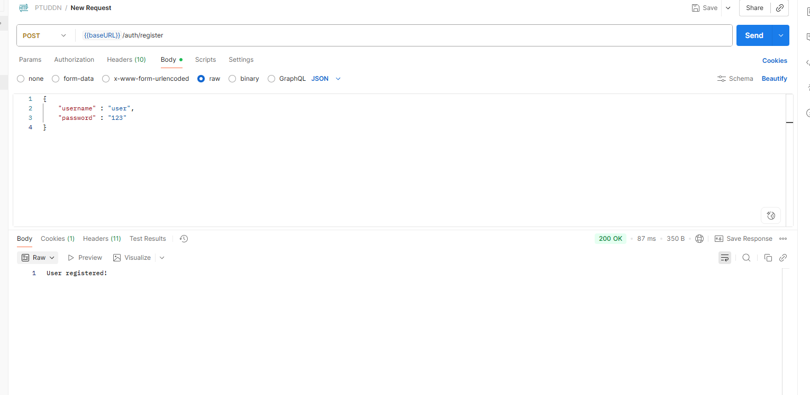
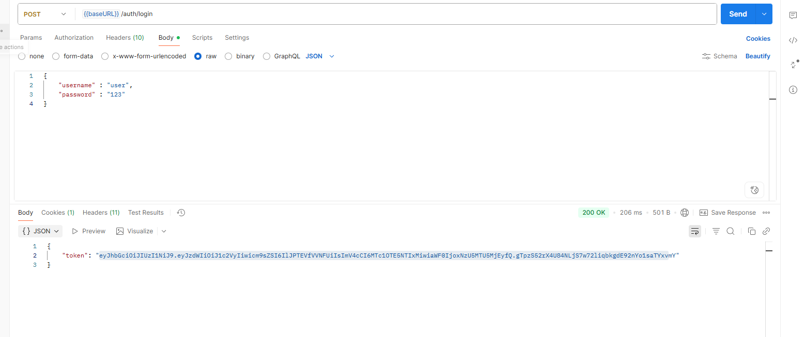
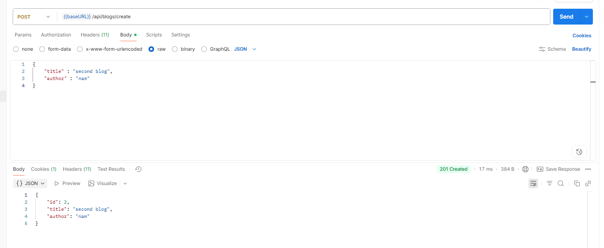
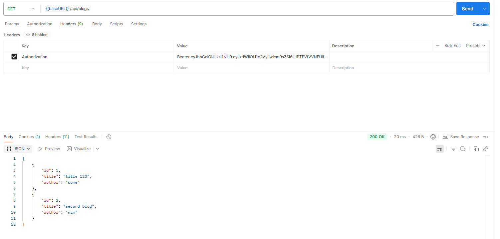
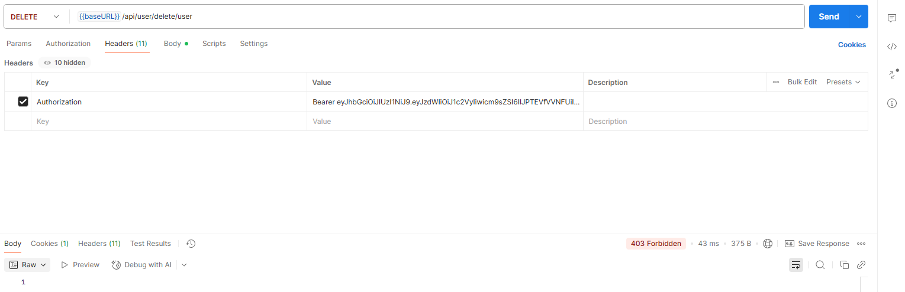
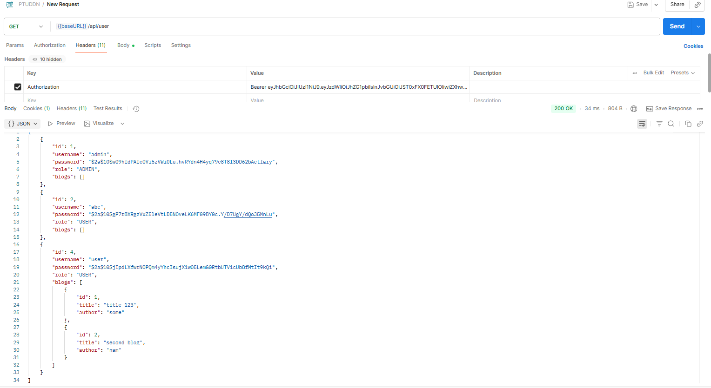
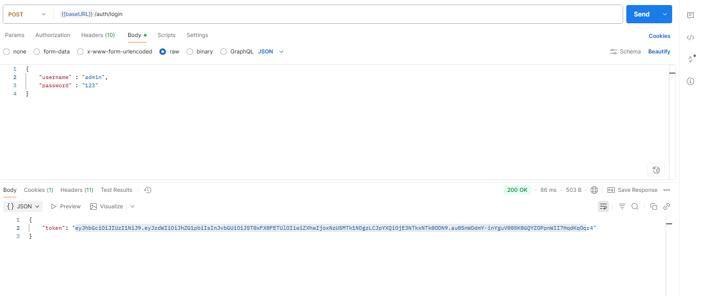
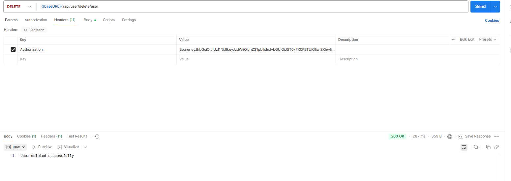
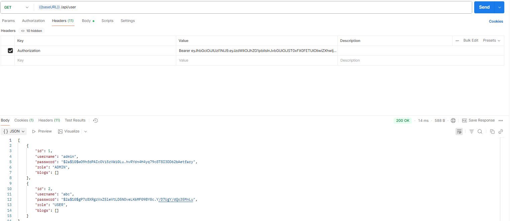

API có sẵn tài khoản admin là (admin | 123)

đăng kí, đăng nhập sẽ cho phép tất cả người dùng

đăng kí tk (user | 123)

sau khi login với tk user vừa đki thì đc token jwt

sau khi đăng nhập sẽ sử dụng token để dùng các API
với header Authorization : Bearer "....token...."

Tạo blog dùng của user

kiểm tra blogs của user vừa tạo

Nếu dùng token của user để xóa user khác thì sẽ bị FORBIDDEN

Các tài khoản đang có :

Đăng nhập với tk admin | 123

Xóa tài khoản user với token của admin

danh sách tài khoản sau khi xóa :

