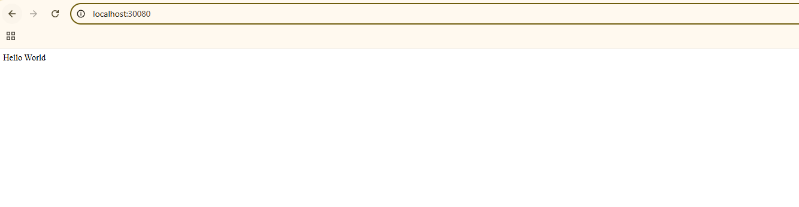
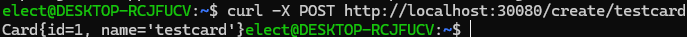
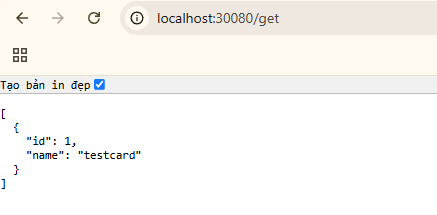
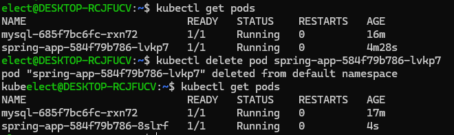
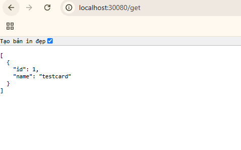

bật k8s trong docker desktop 

build file jar của source code:
`mvn clean package -DskipTests`

build image của app:
`docker build -t spring-app:latest .`

sau khi build xong thì chạy các file deploy của app và mysql:
`kubectl apply -f mysql-pvc.yaml`
`kubectl apply -f deployment-mysql.yaml`
`kubectl apply -f service-mysql.yaml`

`kubectl apply -f deployment.yaml`
`kubectl apply -f service.yaml`

sau khi deploy xong truy cập vào localhost:30080

tạo 1 card

xóa thử pod đang chạy mysql, k8s sẽ tự động tạo pod mới

và dữ liệu cũ vẫn được luu
